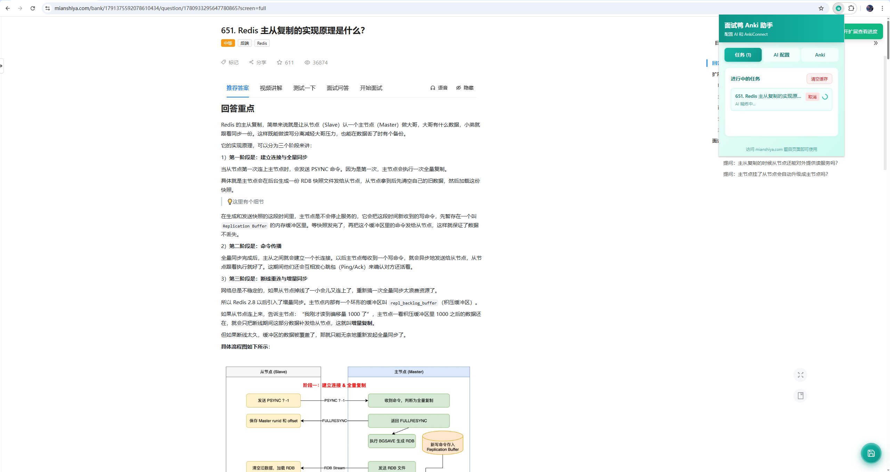
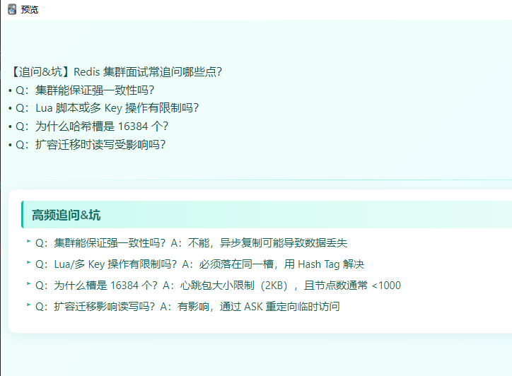
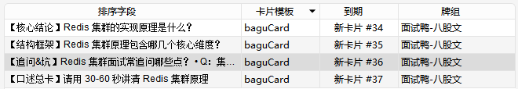

# 面试鸭 Anki 助手

将面试鸭（mianshiya.com）题目一键保存到 Anki 的浏览器扩展。

## 功能特性

- 🔘 **悬浮按钮**: 在面试鸭题目详情页自动显示「保存到 Anki」按钮
- 🤖 **AI 精炼**: 使用 AI 将题目和答案精炼成高质量 Anki 卡片（3+1 卡组模式）
- 📚 **AnkiConnect 集成**: 自动添加卡片到指定牌组
- ⚙️ **灵活配置**: 支持 OpenAI 兼容接口（包括本地模型）
- 🔄 **自定义 Anki 地址**: 支持自定义 AnkiConnect 的 Host 和端口
- 🧹 **缓存管理**: 一键清空已收集题目缓存

## 效果预览

| 插件弹窗 | Anki 卡片预览 | 生成的卡片 |
|:---:|:---:|:---:|
|  |  |  |

## 安装

### 前置要求

- Node.js 18+
- pnpm（推荐）或 npm
- Anki + AnkiConnect 插件

### 构建步骤

```bash
# 安装依赖
pnpm install

# 构建扩展
pnpm build
```

### 加载扩展

1. 打开 Chrome 浏览器
2. 访问 `chrome://extensions/`
3. 启用「开发者模式」（右上角开关）
4. 点击「加载已解压的扩展程序」
5. 选择项目的 `.output/chrome-mv3` 目录

## 使用教程

### 第一步：安装 AnkiConnect 插件

1. 打开 Anki
2. 菜单栏：工具 → 插件 → 获取插件
3. 输入代码：`2055492159`
4. 重启 Anki

### 第二步：配置 AI 接口

点击扩展图标打开 Popup 配置界面，切换到「AI 配置」标签：

| 字段 | 说明 | 示例 |
|------|------|------|
| API Base URL | OpenAI 兼容接口地址 | `https://api.openai.com/v1` |
| API Key | API 密钥 | `sk-xxx...` |
| 模型 | 模型名称 | `gpt-4o-mini` |

> 支持所有 OpenAI 兼容接口，如 DeepSeek、通义千问、本地 Ollama 等。

配置完成后点击「保存配置」，然后点击「测试连接」验证配置是否正确。

### 第三步：配置 AnkiConnect

切换到「Anki」标签：

**连接配置**
| 字段 | 说明 | 默认值 |
|------|------|--------|
| Host | AnkiConnect 地址 | `localhost` |
| 端口 | AnkiConnect 端口 | `8765` |

**卡片配置**
| 字段 | 说明 | 默认值 |
|------|------|--------|
| 牌组名称 | 目标牌组 | `面试鸭-八股文` |
| 笔记类型 | Anki 笔记类型 | `Basic` |
| 正面字段 | Front 字段名 | `Front` |
| 背面字段 | Back 字段名 | `Back` |

配置完成后点击「保存配置」，然后点击「测试连接」验证 Anki 是否正常运行。

### 第四步：设置 Anki 卡片模板（推荐）

为了让卡片显示更美观，建议在 Anki 中设置卡片模板：

1. 打开 Anki PC 端
2. 工具 → 管理笔记模板
3. 选择你的笔记类型（如 Basic）
4. 点击「卡片」
5. 将 [templates/anki-card-template.md](templates/anki-card-template.md) 中的 HTML 和 CSS 复制到对应框内：
   - 正面模板 → Front Template 框
   - 背面模板 → Back Template 框
   - 样式 → Styling 框

模板特性：
- 适配手机端显示
- 支持深色模式
- 代码高亮样式
- 清晰的层次结构

### 第五步：开始使用

1. 访问面试鸭网站 的任意题目详情页
2. 页面右下角会出现悬浮按钮
3. 点击按钮，等待处理完成
4. 成功后卡片自动添加到 Anki

## AI 精炼说明

本工具使用 AI 将题目精炼为 **3+1 卡组模式**，每道题生成 4 张卡片：

| 卡片类型 | 用途 | 特点 |
|---------|------|------|
| 核心结论卡 | 一句话讲清"是什么" | 1-2 句话，最核心 |
| 结构框架卡 | 总-分骨架列出分类/流程 | 只保留框架词 |
| 追问&坑卡 | 面试常追问点 + 易错点 | Q→A 超短句 |
| 口述总卡 | 30-60 秒口述模板 | 关键词串联前三张 |

**内容原则**：
- 极简：只保留"可检索关键词"
- 无代码：不输出代码块/示例代码
- 面试导向：优先"区分点/边界/适用场景"
- HTML 格式：支持 `<h3> <p> <ul> <li> <strong> <code>`

## 功能说明

### 清空缓存

在「任务」标签页，点击「清空缓存」按钮可以清除浏览器本地存储的已收集题目记录。

使用场景：
- 想重新收集之前已添加的题目
- 更换 Anki 数据库后需要重新同步

### 自动保存配置

关闭 Popup 窗口时，如果有未保存的配置变更，会自动保存。

### 重复检测

工具会自动检测题目是否已收集，避免重复添加：
- 本地缓存检测（快速）
- Anki tag 检测（跨设备同步）

> 检测时会自动忽略题目标题中的空格，确保 "Redis 集群" 和 "Redis集群" 被识别为同一题。

## 技术栈

- [WXT](https://wxt.dev/) - 现代化浏览器扩展框架
- [React 18](https://react.dev/) - UI 框架
- [TypeScript](https://www.typescriptlang.org/) - 类型安全
- [Tailwind CSS](https://tailwindcss.com/) - 样式
- [Zustand](https://github.com/pmndrs/zustand) - 状态管理

## 项目结构

```
├── entrypoints/
│   ├── background.ts      # 后台脚本
│   ├── content.ts         # 内容脚本
│   └── popup/             # Popup 界面
├── store/
│   └── useAppStore.ts     # Zustand 状态管理
├── types/
│   └── index.ts           # TypeScript 类型定义
├── utils/
│   └── message.ts         # 消息通信工具
└── templates/
    └── anki-card-template.md  # Anki 卡片模板
```

## 开发

```bash
# 安装依赖
pnpm install

# 构建
pnpm build

# 构建 Firefox 版本
pnpm build:firefox

# 打包 zip
pnpm zip
```

## 许可证

MIT
